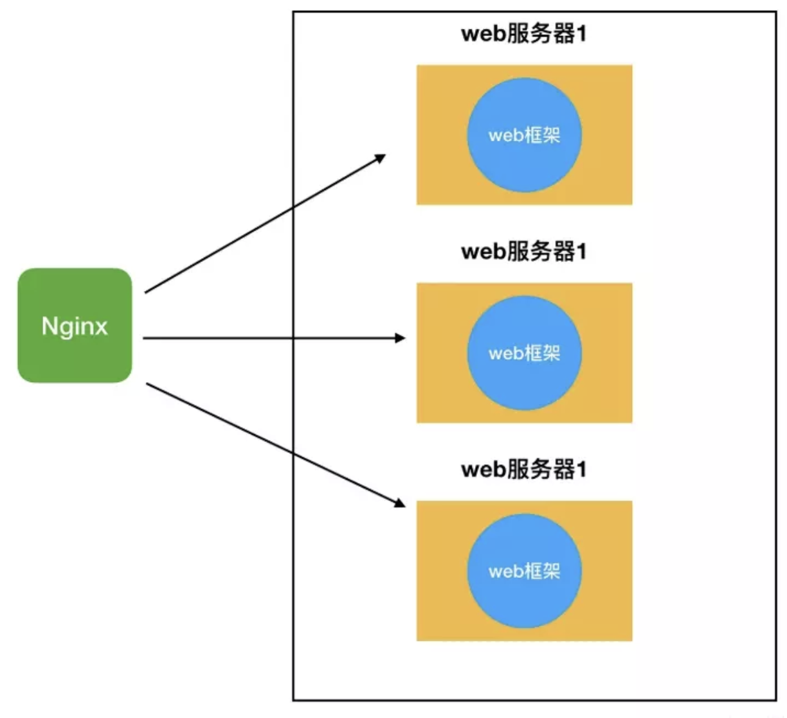
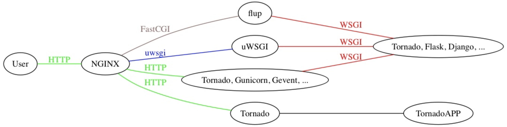
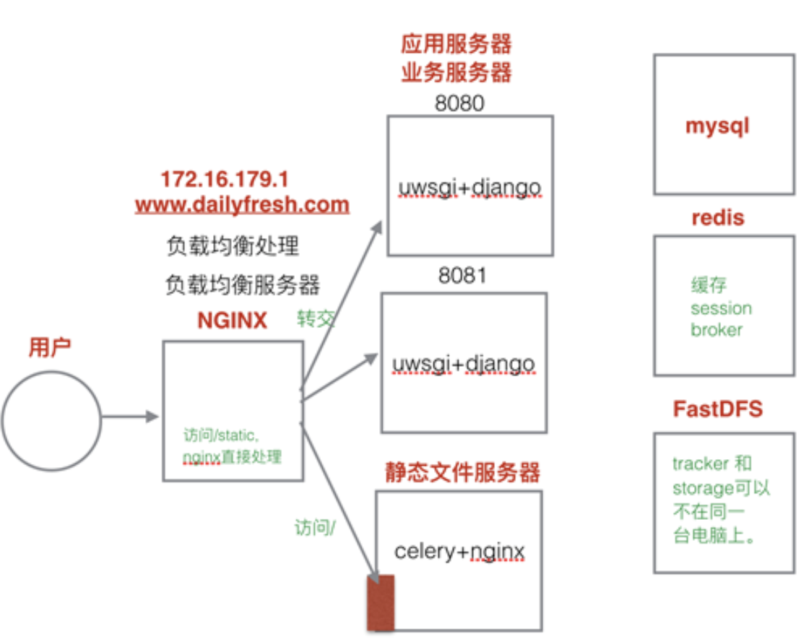
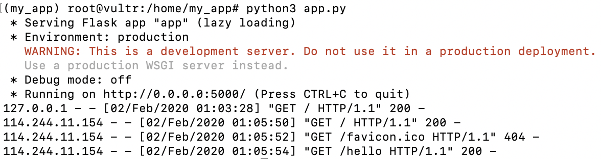
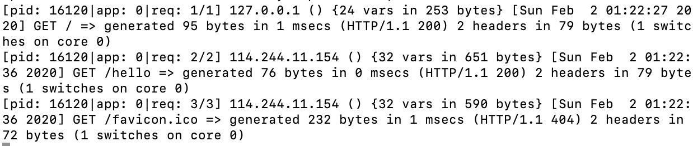

Remote Login
--
可以使用ssh通过服务器所在的公网ip或局域网ip进行远程登录，即. 

```
ssh user_name@server_ip
```
top可以显示系统整体以及各个进程的资源占用和消耗情况. 

```
top -p procss_num   
top -u user_name
```

Web Server Software 
--
web服务器主要用来接受客户端请求，建立连接，转发响应的程序。目前主要的web服务器主要有以下：

* Apache.
* NGINX
* Microsoft IIS
* Tornado
* XAMPP
* Caddy

Install and Run Nginx 

1. Type ```apt-get install nginx``` to install nginx on Ubuntu
2. Start Nginx by ```/etc/init.d/nginx start```
3. Then open a web browser and type the address, eg: 45.32.207.39  

可以通过```systemctl status nginx```查看Nginx是否启动。  Nginx默认使用80端口，可以通过```netstat -lntup```验证。

note:   
1. You can also check if the nginx is runing by ```htop```. There should be "nginx master proccess" and "nginx worker process" in the list.  
2. Rember everytime you make changes to the Nginx configuration file, you will neet to restart Nginx by ```/etc/init.d/nginx restart```.
3. make a copy of original config file by ```cp  /etc/nginx/nginx.conf  /etc/nginx.conf.orig ```

Ref: http://tutorials.jenkov.com/nginx/index.html

WSGI协议
--
WSGI是一个针对python的WEB服务器网关接口协议，定义了WEB服务器如何与Python应用程序间的交互，它相当于两者之间的一个桥梁，两者只要按照WSGI协议便能相互交流，实现任意一个web服务器都能搭配任意一个python网络框架，目前使用WSGI协议的框架有flask, django等，web服务器包括uWSGI和Gunicorn等。  

总而言之，WSGI协议可实现以下三个功能：

1. 让web服务器知道如何调用Python应用程序，并且把用户的请求告诉应用程序
2. 让python应用程序知道用户的具体请求是什么，以及如何返回结果给web服务器
3. 它统一了python不通的网络框架和web服务器之间的通信协议

uWSGI
--
一种实现了WSGI协议和uwsgi协议的web服务器，即用来接受客户端请求，并使用WSGI协议将请求转发给python网络应用服务。实际上，一个uWSGI的web服务器，再加上Django这样的web框架，就已经可以实现网站的功能了

*既然有了uWSGI，为何还需要Nginx？
当访问量一旦过大，就需要分布式服务器，即需要多台web服务器（uWSGI）来处理请求，Nginx可以实现反向代理，即代理服务器，相当于管家的角色，将请求分发至各个uWSGI服务器中进行处理*    

使用```pipenv install uswsgi```或```pip install uswsgi```安装uwsgi（需要安装在虚拟环境内）。  
以下是一个简单的满足WSGI协议的web应用程序（本质与flask, django一样），uWSGI默认找名为```application```的入口函数

```
//foobar.py
def application(environ, start_response): 
    start_response('200 OK', [('Content-Type', 'text/html')]). 
    return ["<h1 style='color:blue'>Hello There!</h1>"]
``` 
现在可以用```uwsgi --http :9090 --wsgi-file foobar.py```直接启动服务。  
uWSGI默认启动一个单一的进程和一个单一的线程，可以通过以下命令启动4个进程，每个进程有个2个线程。  

```
uwsgi --http :9090 --wsgi-file foobar.py --master --processes 4 --threads 2
```

可通过以下命令使用uwsgi来启动flask服务. 
```uwsgi --socket 0.0.0.0:5000 --protocol=http -w wsgi:app```. 
/root/wsgi_tutorial。
uwsgi协议
--
uWSGI服务器与其他web服务器，例如NGINX服务器，的通信协议。即uWSGI web服务器与网络框架应用程序通过WSGI协议交流，与其他例如NGINX服务器用uwsgi协议交流。各个部分关系如下图：  




WEB Application
--
当host=127.0.0.1并在本地启动服务时，flask启动它内置专门用来测试的web server，127.0.0.1只监听本地访问。  
当host=0.0.0.0时，flask监听所有端口，即公网ip可访问该flask服务(This tells your operating system to listen on a public IP.)

```
app.run(debug=DEBUG, host = HOST, port = PORT)
```

如果已经启动了Nginx，此时80端口已被占用，可将port=5000，并输入公网ip：5000访问该服务。

实战
--
安装所有依赖程序

```
apt-get install python3-pip python3-dev build-essential nginx  
pip3 install pipenv  
pipenv install flask uwsgi
```
###1. 使用flask内置web服务器来运行网络服务处理网络请求

使用以下脚本用来测试

```
#!/usr/bin/python3

from flask import Flask
app = Flask(__name__)

@app.route("/")
def index():
    return """
        Welcome to my website!<br /><br />
        <a href="/hello">Go to hello world</a>
    """

@app.route("/hello")
def hello():
    return """
        Hello World!<br /><br />
        <a href="/">Back to index</a>
    """

if __name__ == '__main__':
    # Will make the server available externally as well
    app.run(host='0.0.0.0')
```
启动后（**注意：此时使用flask内置的web服务器**），**由于host=0.0.0.0，此时监听所有端口**，包括内部（127.0.0.01）和外部的（公网ip）。注意以下访问ip分别来自内部和外部。


###2. 使用uWSGI作为web服务器来运行服务（而不是使用flask内置web服务器）
添加以下脚本```wsgi.py```

```
#!/usr/bin/python3

from app import app as application

if __name__ == "__main__":
    application.run()
```
使用以下命令启动uWSGI的web服务器。注意```--protocal-http```表示通信协议为http。

```uwsgi --socket 0.0.0.0:8000 --protocol=http --wsgi-file wsgi.py``` 

如下图，此时可分别从内部和外部通过8000端口进行访问。



#### 创建uWSGI配置ini文件```app.ini```
注意```--http-socket```表明uWSGI服务器与外部socket通信协议使用http。配置完成后用以下命令启动。
```/root/.local/share/virtualenvs/my_app-9Og22tQu/bin/uwsgi --ini /home/my_app/app.ini```

```
[uwsgi]
module = wsgi
http-socket = 0.0.0.0:8080

master = true
processes = 10

die-on-term = true
```
其等同于：
```uwsgi --http-socket 0.0.0.0:8000 --wsgi-file wsgi.py --master --processes 10```

### 3. 使用NGINX作为前置web服务器通过uwsgi协议转发请求至uWSGI web服务器
创建```/etc/nginx/sites-enabled/my_app```文件，并添加以下配置脚本： 

```
server {
    listen 80;
    server_name 95.179.223.87; # Replace with the actual domain name

    location / {
        include uwsgi_params;
        uwsgi_pass 127.0.0.1:3031;
    }
}
```
其中，根据官方文档，以下部分解释为**This means “pass every request to the server bound to port 3031 speaking the uwsgi protocol”.**

```
location / {
    include uwsgi_params;
    uwsgi_pass 127.0.0.1:3031;
}
```
通过以下命令启动uWSGI服务器，监听NGINX发送至3031端口的socket请求
```uwsgi --socket 127.0.0.1:3031 --wsgi-file wsgi.py --master --processes 10```
uwsgi --wsgi-file wsgi.py --socket 127.0.0.1:3031 --stats 127.0.0.1:3030 --stats-http

创建以下```app.ini```配置文件以启动uWSGI服务器，注意此时添加了socket文件所在路径

```
[uwsgi]
module = wsgi

socket = my_app.sock
chmod-socket = 660
#vacuum = true

master = true
processes = 10

die-on-term = true
```
通过以下命令启动后，在目录下创建```my_app.sock```文件

```
uwsgi --ini app.ini
```

同时需要将NGINX改为：

```
location / {
    include uwsgi_params;
    uwsgi_pass unix:/home/my_app/my_app.sock;
}
```
再次运行```uwsgi --ini app.ini```，访问公网ip出现502报错，查看错误日志```less /var/log/nginx/error.log```发现```my_app.sock failed (13: Permission denied) ```  
网上查找后发现发现nginx进程的用户是```www-data```，而我们创建```my_app.sock```文件的用户是```root```，需要通过```nano /etc/nginx/nginx.conf```将
```user www-data;```改为``user root;```即可。

###参考文献
1. https://www.gab.lc/articles/flask-nginx-uwsgi/
2. https://juejin.im/post/5ccd3695f265da03587c0d9d
3. https://www.digitalocean.com/community/tutorials/how-to-serve-flask-applications-with-uswgi-and-nginx-on-ubuntu-18-04
4. https://uwsgi-docs.readthedocs.io/en/latest/WSGIquickstart.html
5. https://uwsgi-docs-additions.readthedocs.io/en/latest/Options.html
6. https://uwsgi-docs.readthedocs.io/en/latest/Nginx.html
7. https://www.cnblogs.com/tortoise512/p/10825075.html